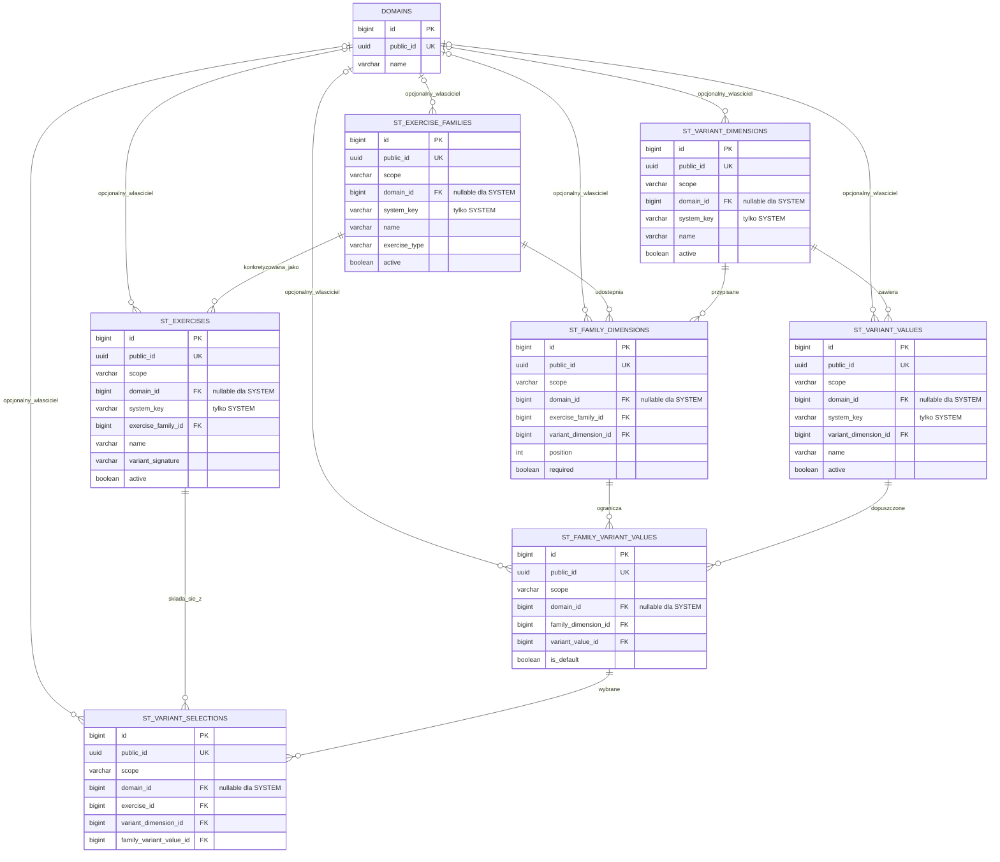
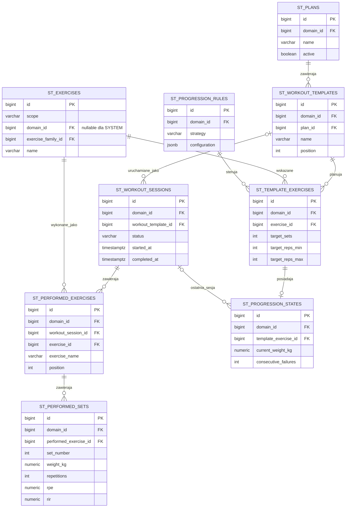

# Moduł treningów siłowych — projekt domeny i modelu danych

## 1. Cel dokumentu

Dokument opisuje projekt modułu wspierającego prowadzenie treningów siłowych w aplikacji Spring Boot. Moduł ma umożliwiać:

- tworzenie rodzin ćwiczeń i ich wariantów;
- definiowanie własnych wariantów przez użytkowników domeny;
- budowanie konkretnych ćwiczeń z wybranych wariantów;
- tworzenie planów i szablonów treningowych;
- rejestrowanie wykonanych treningów i serii;
- śledzenie progresu oraz rekordów;
- automatyczne proponowanie obciążenia.

Projekt zakłada:

- **PostgreSQL 18.4** jako bazę danych;
- **Spring Boot i JPA/Hibernate** jako warstwę persystencji;
- dane rozdzielone za pomocą istniejącej tabeli `domains`;
- współdzielony katalog systemowy rozszerzany przez dane poszczególnych domen;
- wspólny prefiks `strength_training_` dla wszystkich tabel modułu;
- nazwy tabel w liczbie mnogiej;
- osobną sekwencję PostgreSQL dla kolumny `id` każdej tabeli;
- `BIGINT` jako typ technicznego identyfikatora encji;
- `UUID` jako publiczny identyfikator używany m.in. przez GraphQL.

Dokument jest projektem logicznym. Szczegółowa migracja Flyway może zostać przygotowana na jego podstawie.

---

## 2. Konwencje techniczne

### 2.1. Nazewnictwo

Wszystkie tabele modułu zaczynają się prefiksem:

```text
strength_training_
```

Dzięki temu są zgrupowane alfabetycznie w narzędziach do przeglądania bazy danych.

Przykłady:

```text
strength_training_exercise_families
strength_training_exercises
strength_training_plans
strength_training_workout_sessions
```

Nazwy constraintów powinny być jawne i skrócone, aby nie przekraczać limitu 63 bajtów obowiązującego dla identyfikatorów PostgreSQL. Zalecane prefiksy:

| Rodzaj | Prefiks | Przykład |
|---|---|---|
| Primary key | `pk_st_` | `pk_st_exercise_families` |
| Foreign key | `fk_st_` | `fk_st_exercises__domain` |
| Unique constraint | `ux_st_` | `ux_st_exercises__public_id` |
| Index | `ix_st_` | `ix_st_exercises__domain_active` |
| Check constraint | `ck_st_` | `ck_st_sets__repetitions` |

### 2.2. Wspólne kolumny encji

Każda tabela modułu jest mapowana na osobną encję JPA i zawiera co najmniej:

| Kolumna | PostgreSQL | Java | Znaczenie |
|---|---|---|---|
| `id` | `bigint` | `Long` | Techniczny klucz główny |
| `public_id` | `uuid` | `UUID` | Identyfikator publiczny, używany przez GraphQL |

Encje należące zawsze do użytkownika domeny zawierają ponadto:

| Kolumna | PostgreSQL | Java | Znaczenie |
|---|---|---|---|
| `domain_id` | `bigint not null` | `Domain` | Domena będąca właścicielem danych |

Encje katalogowe mogą być systemowe albo domenowe:

| Kolumna | PostgreSQL | Java | Znaczenie |
|---|---|---|---|
| `scope` | `varchar(20) not null` | `CatalogScope` | `SYSTEM` albo `DOMAIN` |
| `domain_id` | `bigint null` | `Domain` | `NULL` wyłącznie dla danych systemowych |

W tabelach modyfikowanych samodzielnie przez użytkownika warto dodatkowo stosować:

| Kolumna | PostgreSQL | Java |
|---|---|---|
| `created_at` | `timestamptz` | `Instant` albo `OffsetDateTime` |
| `updated_at` | `timestamptz` | `Instant` albo `OffsetDateTime` |
| `active` | `boolean` | `boolean` |

`public_id` powinno domyślnie otrzymywać wartość `gen_random_uuid()` i mieć globalny constraint `UNIQUE`, zgodnie z konwencją zastosowaną w tabeli `domains`.

### 2.3. Zakres systemowy i domenowy

Model rozróżnia trzy zakresy danych:

| Rodzaj | `scope` | `domain_id` | Widoczność |
|---|---|---|---|
| Katalog systemowy | `SYSTEM` | `NULL` | Wszystkie domeny |
| Katalog domenowy | `DOMAIN` | wymagane | Tylko wskazana domena |
| Dane operacyjne | nie dotyczy | wymagane | Tylko wskazana domena |

Katalog systemowy nie jest kopiowany podczas tworzenia domeny. Nowe systemowe rodziny, wymiary i wartości stają się automatycznie widoczne we wszystkich domenach. Domena może równolegle tworzyć własne elementy katalogowe.

Spójność pary `scope`/`domain_id` zabezpiecza constraint:

```sql
constraint ck_st_example__scope_domain check (
    (scope = 'SYSTEM' and domain_id is null)
    or
    (scope = 'DOMAIN' and domain_id is not null)
)
```

`NULL` nie ma zatem samodzielnego, ukrytego znaczenia biznesowego. Jest dozwolonym i wymaganym stanem wynikającym z jawnego `scope = SYSTEM`.

Migracja `V51` tworzy katalog od razu ze `scope`, opcjonalnym `domain_id`, `system_key`, indeksami częściowymi oraz relacjami pozwalającymi łączyć katalog systemowy z rozszerzeniami domenowymi.

Do encji katalogowych należą:

- `strength_training_exercise_families`;
- `strength_training_variant_dimensions`;
- `strength_training_variant_values`;
- `strength_training_exercise_family_dimensions`;
- `strength_training_exercise_family_variant_values`;
- `strength_training_exercises`;
- `strength_training_exercise_variant_selections`.

Konkretne ćwiczenia wraz z wyborami wariantów mogą być systemowe albo domenowe. Plany, szablony, reguły progresji i cała historia zawsze należą do domeny, dlatego ich `domain_id` pozostaje `NOT NULL`.

Rekordy systemowe powinny być tworzone przez migracje Flyway lub osobny mechanizm administracyjny. Zwykły użytkownik nie może ich edytować ani dezaktywować.

### 2.4. Sekwencja osobna dla każdej tabeli

Każda tabela ma własną sekwencję o nazwie:

```text
<nazwa_tabeli>_id_seq
```

Przykład dla `strength_training_exercise_families`:

```sql
create sequence strength_training_exercise_families_id_seq
    as bigint
    start with 1
    increment by 1;

create table strength_training_exercise_families
(
    id bigint default nextval('strength_training_exercise_families_id_seq'::regclass) not null
        constraint pk_st_exercise_families primary key,
    public_id uuid default gen_random_uuid() not null
        constraint ux_st_exercise_families__public_id unique,
    scope varchar(20) not null,
    domain_id bigint
        constraint fk_st_exercise_families__domain references domains,
    system_key varchar(100),
    name varchar(255) not null,
    exercise_type varchar(50) not null,
    active boolean default true not null,
    created_at timestamptz default current_timestamp not null,
    updated_at timestamptz default current_timestamp not null,
    constraint ck_st_exercise_families__scope check (
        (scope = 'SYSTEM' and domain_id is null and system_key is not null)
        or
        (scope = 'DOMAIN' and domain_id is not null and system_key is null)
    ),
    constraint ck_st_exercise_families__scope_value check (
        scope in ('SYSTEM', 'DOMAIN')
    )
);

create unique index ux_st_exercise_families__system_key
    on strength_training_exercise_families (system_key)
    where scope = 'SYSTEM';

create unique index ux_st_exercise_families__system_name
    on strength_training_exercise_families (lower(name))
    where scope = 'SYSTEM';

create unique index ux_st_exercise_families__domain_name
    on strength_training_exercise_families (domain_id, lower(name))
    where scope = 'DOMAIN';

alter sequence strength_training_exercise_families_id_seq
    owned by strength_training_exercise_families.id;

alter table strength_training_exercise_families owner to accountant;
alter sequence strength_training_exercise_families_id_seq owner to accountant;
```

Encja JPA używa odpowiadającej jej sekwencji:

```java
@Entity
@Table(name = "strength_training_exercise_families")
@SequenceGenerator(
        name = "strengthTrainingExerciseFamiliesSequence",
        sequenceName = "strength_training_exercise_families_id_seq",
        allocationSize = 1
)
class ExerciseFamily {

    @Id
    @GeneratedValue(
            strategy = GenerationType.SEQUENCE,
            generator = "strengthTrainingExerciseFamiliesSequence"
    )
    private Long id;

    @Enumerated(EnumType.STRING)
    @Column(nullable = false, length = 20)
    private CatalogScope scope;

    @ManyToOne(fetch = FetchType.LAZY)
    @JoinColumn(name = "domain_id")
    private Domain domain;
}
```

Każda encja deklaruje własny `@SequenceGenerator`. `allocationSize = 1` odpowiada sekwencjom z `INCREMENT BY 1` i jest najprostszym, przewidywalnym wariantem integracji Hibernate z istniejącą konwencją bazy.

---

## 3. Podział domeny

Model dzieli się na cztery części:

1. katalog rodzin ćwiczeń i wariantów;
2. plany oraz szablony treningowe;
3. historia wykonanych treningów;
4. reguły i stan progresji.

Najważniejsze rozróżnienie występuje między:

- **rodziną ćwiczenia**, np. „Wyciskanie na ławce”;
- **wymiarem wariantu**, np. „Kąt ławki”;
- **wartością wariantu**, np. „Skos dodatni”;
- **konkretnym ćwiczeniem**, np. „Wyciskanie na skosie dodatnim, wąskim chwytem, z nogami na ziemi”.

Wszystkie cztery pojęcia tworzą współdzielony i rozszerzalny katalog. Konkretne ćwiczenie może być gotową konfiguracją systemową widoczną we wszystkich domenach albo konfiguracją utworzoną przez jedną domenę.

---

## 4. Katalog ćwiczeń i wariantów

### 4.1. Schemat relacji



W diagramie użyto skróconych nazw encji. Opcjonalne powiązanie z `DOMAINS` oznacza, że rekord katalogowy ma właściciela tylko dla `scope = DOMAIN`.

### 4.2. `strength_training_exercise_families`

Reprezentuje bazowy ruch lub rodzinę ćwiczeń, np. wyciskanie na ławce, przysiad, martwy ciąg albo wiosłowanie.

| Kolumna | Typ | Opis |
|---|---|---|
| `scope` | `varchar(20)` | `SYSTEM` albo `DOMAIN` |
| `domain_id` | `bigint` | `NULL` dla rodziny systemowej |
| `system_key` | `varchar(100)` | Stabilny kod systemowy, np. `BENCH_PRESS` |
| `name` | `varchar(255)` | Nazwa rodziny |
| `exercise_type` | `varchar(50)` | Sposób rejestrowania wyniku |
| `active` | `boolean` | Ukrywanie bez usuwania historii |

Przykładowe `exercise_type`: `WEIGHT_REPS`, `BODYWEIGHT_REPS`, `DURATION` i `DISTANCE`. W JPA pole jest mapowane przez `@Enumerated(EnumType.STRING)`. W PostgreSQL jest to kolumna tekstowa z `CHECK`, co ułatwia rozwijanie listy migracjami.

Rodzina systemowa jest dostępna we wszystkich domenach. Rodzina domenowa jest widoczna tylko dla właściciela. `system_key` identyfikuje systemowy rekord niezależnie od jego nazwy i ewentualnego tłumaczenia.

### 4.3. `strength_training_variant_dimensions`

Reprezentuje niezależną cechę ćwiczenia, np. kąt ławki, szerokość chwytu, pozycję nóg, rodzaj sztangi, tempo albo obecność pauzy.

Tabela używa `scope`, opcjonalnego `domain_id` i `system_key` według tych samych reguł co rodziny. Domena może utworzyć własny wymiar i przypisać go do własnej albo systemowej rodziny.

W pierwszej wersji wymiar ma wybór pojedynczy: konkretne ćwiczenie może wskazać najwyżej jedną wartość danego wymiaru.

### 4.4. `strength_training_variant_values`

Reprezentuje wartość wymiaru, np.:

| Wymiar | Wartości |
|---|---|
| Kąt ławki | Ławka prosta, skos dodatni, skos ujemny |
| Szerokość chwytu | Wąski, normalny |
| Pozycja nóg | Na ziemi, na ławce |

Tabela zawiera `scope`, opcjonalne `domain_id` i `system_key`. Wartość domenowa może rozszerzać systemowy wymiar, np. domena może dodać własne „15°” do systemowego „Kąta ławki”. Rekord systemowy może wskazywać tylko systemowy wymiar. Rekord domenowy może wskazywać wymiar systemowy albo wymiar tej samej domeny.

Unikalność nazw zabezpieczają osobne indeksy:

```sql
create unique index ux_st_variant_values__system_name
    on strength_training_variant_values
        (variant_dimension_id, lower(name))
    where scope = 'SYSTEM';

create unique index ux_st_variant_values__system_key
    on strength_training_variant_values
        (variant_dimension_id, system_key)
    where scope = 'SYSTEM';

create unique index ux_st_variant_values__domain_name
    on strength_training_variant_values
        (domain_id, variant_dimension_id, lower(name))
    where scope = 'DOMAIN';
```

### 4.5. `strength_training_exercise_family_dimensions`

Łączy rodzinę z wymiarem, który może być dla niej stosowany. Jest pełnoprawną encją JPA, a nie `@ManyToMany`, ponieważ ma własne dane: `position`, `required`, `scope` i `domain_id`.

Powiązanie systemowe może łączyć wyłącznie systemową rodzinę z systemowym wymiarem. Powiązanie domenowe może korzystać z obiektów systemowych albo obiektów tej samej domeny. Pozwala to rozszerzyć systemową rodzinę o własny wymiar bez kopiowania rodziny.

Rozszerzenie nie może powielać widocznej pary `(exercise_family_id, variant_dimension_id)` ani zajmować pozycji używanej już przez powiązanie systemowe. Serwis zapisujący konfigurację sprawdza w tym celu sumę rekordów `SYSTEM` i rekordów bieżącej domeny.

```sql
create unique index ux_st_family_dimensions__system
    on strength_training_exercise_family_dimensions
        (exercise_family_id, variant_dimension_id)
    where scope = 'SYSTEM';

create unique index ux_st_family_dimensions__domain
    on strength_training_exercise_family_dimensions
        (domain_id, exercise_family_id, variant_dimension_id)
    where scope = 'DOMAIN';
```

### 4.6. `strength_training_exercise_family_variant_values`

Określa wartości wymiaru dopuszczone dla rodziny. Powiązanie domenowe może dodać własną wartość do systemowego połączenia rodziny z wymiarem. Powiązanie systemowe może odwoływać się wyłącznie do elementów systemowych.

```sql
create unique index ux_st_family_values__system
    on strength_training_exercise_family_variant_values
        (family_dimension_id, variant_value_id)
    where scope = 'SYSTEM';

create unique index ux_st_family_values__domain
    on strength_training_exercise_family_variant_values
        (domain_id, family_dimension_id, variant_value_id)
    where scope = 'DOMAIN';
```

Systemowa wartość domyślna może zostać przesłonięta ustawieniem domenowym. Najwyżej jedną wartość domyślną na zakres gwarantują:

```sql
create unique index ux_st_family_values__system_default
    on strength_training_exercise_family_variant_values (family_dimension_id)
    where scope = 'SYSTEM' and is_default;

create unique index ux_st_family_values__domain_default
    on strength_training_exercise_family_variant_values
        (domain_id, family_dimension_id)
    where scope = 'DOMAIN' and is_default;
```

Przesłonięcie jest realizowane w warstwie odczytu: oba rekordy pozostają niezmienione, ale gdy istnieje domenowy default, systemowa wartość jest prezentowana klientowi GraphQL z `defaultValue = false`.

### 4.7. `strength_training_exercises`

Reprezentuje konkretną konfigurację ćwiczenia, np. „Wyciskanie na skosie dodatnim, wąskim chwytem, z nogami na ziemi”. Ćwiczenie może być systemowe, dostępne we wszystkich domenach, albo domenowe, widoczne tylko dla właściciela.

| Kolumna | Typ | Opis |
|---|---|---|
| `scope` | `varchar(20)` | `SYSTEM` albo `DOMAIN` |
| `domain_id` | `bigint` | `NULL` dla ćwiczenia systemowego |
| `system_key` | `varchar(100)` | Stabilny kod systemowego ćwiczenia |
| `exercise_family_id` | `bigint` | Widoczna rodzina systemowa albo domenowa |
| `name` | `varchar(255)` | Nazwa własna lub wygenerowana |
| `variant_signature` | `varchar(3000)` | Kanoniczny zapis konfiguracji |
| `active` | `boolean` | Ukrywanie ćwiczenia |

`variant_signature` powstaje z posortowanych semantycznie par `<variant_dimension_public_id>=<variant_value_public_id>`, np. `06ebf3c6-...=5dc56591-...|a7d1788c-...=...`.

```sql
create unique index ux_st_exercises__system_configuration
    on strength_training_exercises
        (exercise_family_id, variant_signature)
    where scope = 'SYSTEM';

create unique index ux_st_exercises__domain_configuration
    on strength_training_exercises
        (domain_id, exercise_family_id, variant_signature)
    where scope = 'DOMAIN';
```

Nazwa nie identyfikuje konfiguracji. Ćwiczenie systemowe może wskazywać wyłącznie rodzinę systemową i używać wyłącznie systemowych wariantów. Ćwiczenie domenowe może wskazywać rodzinę systemową albo rodzinę tej samej domeny oraz łączyć widoczne elementy systemowe i domenowe. Nigdy nie może zależeć od elementu należącego do innej domeny.

`system_key` jest wymagane i unikalne dla `scope = SYSTEM`, a dla `scope = DOMAIN` musi być `NULL`. Spójność `scope`, `domain_id` i `system_key` zabezpiecza taki sam rodzaj constraintu jak w `strength_training_exercise_families`.

```sql
create unique index ux_st_exercises__system_key
    on strength_training_exercises (system_key)
    where scope = 'SYSTEM';
```

### 4.8. `strength_training_exercise_variant_selections`

Reprezentuje wartość wybraną dla konkretnego ćwiczenia. Odwołuje się do `family_variant_value_id`, dzięki czemu wybrana wartość musi być dopuszczona dla rodziny. Wybór dziedziczy zakres ćwiczenia: wybór systemowy należy do ćwiczenia systemowego i może wskazywać wyłącznie systemowe powiązanie, a wybór domenowy należy do ćwiczenia tej samej domeny i może wskazywać powiązanie systemowe albo należące do tej domeny.

Tabela zawiera jawne `scope` i opcjonalne `domain_id`, aby baza mogła kontrolować zgodność zakresu z ćwiczeniem oraz stosować osobne reguły unikalności. Rekomendowane jest kontrolowane powtórzenie `variant_dimension_id`, aby zagwarantować jeden wybór na wymiar:

```sql
create unique index ux_st_variant_selections__system_dimension
    on strength_training_exercise_variant_selections
        (exercise_id, variant_dimension_id)
    where scope = 'SYSTEM';

create unique index ux_st_variant_selections__domain_dimension
    on strength_training_exercise_variant_selections
        (domain_id, exercise_id, variant_dimension_id)
    where scope = 'DOMAIN';
```

### 4.9. Przykład tworzenia ćwiczenia

Dla rodziny „Wyciskanie na ławce” użytkownik wybiera:

| Wymiar | Wybrana wartość |
|---|---|
| Kąt ławki | Skos dodatni |
| Szerokość chwytu | Wąski |
| Pozycja nóg | Na ziemi |

Serwis aplikacyjny tworzący ćwiczenie domenowe:

1. pobiera rodzinę widoczną dla bieżącej domeny;
2. pobiera widoczne systemowe i domenowe wymiary oraz wartości;
3. sprawdza wymagane wymiary;
4. sprawdza dopuszczenie każdej wartości dla rodziny;
5. sprawdza, czy dla wymiaru wybrano najwyżej jedną wartość;
6. buduje deterministyczne `variant_signature`;
7. sprawdza unikalność konfiguracji;
8. zapisuje ćwiczenie i wybory wariantów w jednej transakcji.

### 4.10. Widoczność i rozszerzanie katalogu

Element katalogowy jest widoczny dla bieżącej domeny, gdy:

```sql
scope = 'SYSTEM'
or (scope = 'DOMAIN' and domain_id = :domainId)
```

Model jest addytywny:

- element domenowy nie modyfikuje elementu systemowego;
- domena może dodać rodzinę, wymiar lub wartość;
- domena może utworzyć własne ćwiczenie, a także używać gotowego ćwiczenia systemowego;
- domena może rozszerzyć systemową rodzinę o własny wymiar albo wartość;
- taka sama nazwa nie oznacza automatycznego przesłonięcia elementu systemowego;
- GraphQL powinien zwracać `scope`, aby UI mogło oznaczyć pochodzenie elementu.

Jeśli domena ma móc ukrywać elementy systemowe, należy dodać osobne ustawienia widoczności. Nie należy w tym celu modyfikować globalnego rekordu.

---

## 5. Plany i szablony treningowe

### 5.1. Tabele

| Tabela | Przeznaczenie |
|---|---|
| `strength_training_plans` | Plan, np. „Góra/dół — jesień 2026” |
| `strength_training_workout_templates` | Trening w planie, np. „Góra A” |
| `strength_training_template_exercises` | Ćwiczenie i założenia serii w szablonie |

### 5.2. `strength_training_plans`

Najważniejsze pola:

```text
name
description
active
```

### 5.3. `strength_training_workout_templates`

Najważniejsze pola:

```text
plan_id
name
position
description
```

`position` umożliwia wykonywanie planu jako sekwencji A → B → A → B bez obowiązkowego przypisywania treningów do konkretnych dni tygodnia.

### 5.4. `strength_training_template_exercises`

Najważniejsze pola:

```text
workout_template_id
exercise_id
position
target_sets
target_reps_min
target_reps_max
target_rpe
target_rir
rest_seconds
progression_rule_id
notes
```

Szablon wskazuje konkretne `strength_training_exercises`, a nie samą rodzinę. Historia i progres wyciskania płasko oraz na skosie są dzięki temu rozdzielone.

Szablon domenowy może wskazywać ćwiczenie systemowe albo ćwiczenie należące do tej samej domeny. Nie może wskazywać ćwiczenia innej domeny.

---

## 6. Wykonane treningi

### 6.1. Schemat relacji



### 6.2. `strength_training_workout_sessions`

Reprezentuje konkretny trening.

Najważniejsze pola:

```text
workout_template_id nullable
template_name nullable
status
started_at
completed_at nullable
body_weight_kg nullable
notes
```

`workout_template_id` jest opcjonalne, ponieważ użytkownik może rozpocząć trening bez planu.

`template_name` jest snapshotem nazwy używanej w momencie rozpoczęcia sesji.

### 6.3. `strength_training_performed_exercises`

Reprezentuje ćwiczenie wykonywane podczas sesji.

Najważniejsze pola:

```text
workout_session_id
exercise_id
source_template_exercise_id nullable
exercise_name
position
notes
```

`exercise_name` jest snapshotem. Późniejsza zmiana nazwy ćwiczenia nie zmienia historii treningowej.

`exercise_id` może wskazywać ćwiczenie systemowe albo ćwiczenie należące do domeny sesji. Reguła widoczności jest sprawdzana w chwili dodawania ćwiczenia do sesji; późniejsza dezaktywacja rekordu katalogowego nie zmienia historii.

### 6.4. `strength_training_performed_sets`

Reprezentuje pojedynczą wykonaną serię.

Najważniejsze pola:

```text
performed_exercise_id
set_number
set_type
weight_kg nullable
repetitions nullable
duration_seconds nullable
distance_meters nullable
rpe nullable
rir nullable
completed
performed_at nullable
notes
```

Pola wyniku zależą od `exercise_type`. Dla ćwiczenia siłowego zwykle używane są `weight_kg` i `repetitions`; dla planka `duration_seconds`.

Zalecane typy:

| Wartość | PostgreSQL | Java |
|---|---|---|
| Ciężar | `numeric(7,2)` | `BigDecimal` |
| Dystans | `numeric(9,2)` | `BigDecimal` |
| RPE/RIR | `numeric(3,1)` | `BigDecimal` |
| Liczba powtórzeń | `integer` | `Integer` |

Do ciężaru, dystansu i RPE nie należy używać `double precision` ani Java `double`.

---

## 7. Progresja i dobór obciążenia

### 7.1. `strength_training_progression_rules`

Definiuje algorytm proponowania kolejnego obciążenia.

Najważniejsze pola:

```text
name
strategy
configuration jsonb
active
```

Przykładowe strategie:

- `FIXED_INCREMENT` — dodanie stałego ciężaru po zaliczeniu treningu;
- `DOUBLE_PROGRESSION` — zwiększanie powtórzeń, następnie obciążenia;
- `RPE_BASED` — korekta obciążenia według osiągniętego RPE;
- `PERCENTAGE_OF_1RM` — obciążenie jako procent rekordu;
- `MANUAL` — podpowiedź na podstawie ostatniego treningu.

Przykładowe `configuration`:

```json
{
  "incrementKg": 2.5,
  "minimumSuccessfulSets": 5,
  "requiredRepsPerSet": 5,
  "failureAction": "REPEAT",
  "failuresBeforeDeload": 3,
  "deloadPercent": 10
}
```

W JPA `jsonb` można mapować za pomocą Hibernate 6:

```java
@JdbcTypeCode(SqlTypes.JSON)
@Column(name = "configuration", columnDefinition = "jsonb", nullable = false)
private ProgressionConfiguration configuration;
```

Kod Javy powinien używać typowanych konfiguracji, najlepiej opartych na `sealed interface`, zamiast przekazywać dowolne `Map<String, Object>`.

### 7.2. `strength_training_exercise_progression_states`

Przechowuje bieżący stan algorytmu dla ćwiczenia w konkretnym miejscu planu.

Najważniejsze pola:

```text
template_exercise_id
current_weight_kg
current_repetitions
consecutive_failures
last_completed_session_id nullable
updated_at
```

Constraint:

```text
UNIQUE (domain_id, template_exercise_id)
```

Stan progresji jest pamięcią pomocniczą. Źródłem prawdy pozostają wykonane serie. Powinno być możliwe ponowne wyliczenie stanu z historii.

---

## 8. Rekordy i statystyki

W pierwszej wersji rekordy nie wymagają osobnej tabeli. Można je obliczać na podstawie `strength_training_performed_sets`:

- największy ciężar;
- największa liczba powtórzeń dla danego ciężaru;
- największa objętość serii;
- największa objętość treningu;
- szacowane 1RM.

Przykładowy wzór Epleya:

```text
e1RM = weight × (1 + repetitions / 30)
```

Jeżeli liczba danych zacznie wpływać na wydajność, można później dodać tabelę cache, np. `strength_training_personal_records`. Nie powinna ona zastępować historii wykonanych serii.

Statystyki mogą być liczone:

- dla konkretnego `exercise_id`, np. wyciskania na skosie dodatnim;
- dla `exercise_family_id`, np. wszystkich odmian wyciskania na ławce.

---

## 9. Lista tabel i sekwencji

Każda poniższa tabela ma własne `id`, `public_id` oraz własną sekwencję. W tabelach katalogowych, w tym w ćwiczeniach i ich wyborach wariantów, `domain_id` jest opcjonalne i kontrolowane przez `scope`; w tabelach operacyjnych jest wymagane.

| Tabela | Zakres | Sekwencja identyfikatora |
|---|---|---|
| `strength_training_exercise_families` | katalog `SYSTEM`/`DOMAIN` | `strength_training_exercise_families_id_seq` |
| `strength_training_variant_dimensions` | katalog `SYSTEM`/`DOMAIN` | `strength_training_variant_dimensions_id_seq` |
| `strength_training_variant_values` | katalog `SYSTEM`/`DOMAIN` | `strength_training_variant_values_id_seq` |
| `strength_training_exercise_family_dimensions` | katalog `SYSTEM`/`DOMAIN` | `strength_training_exercise_family_dimensions_id_seq` |
| `strength_training_exercise_family_variant_values` | katalog `SYSTEM`/`DOMAIN` | `strength_training_exercise_family_variant_values_id_seq` |
| `strength_training_exercises` | katalog `SYSTEM`/`DOMAIN` | `strength_training_exercises_id_seq` |
| `strength_training_exercise_variant_selections` | katalog `SYSTEM`/`DOMAIN` | `strength_training_exercise_variant_selections_id_seq` |
| `strength_training_plans` | zawsze domenowy | `strength_training_plans_id_seq` |
| `strength_training_workout_templates` | zawsze domenowy | `strength_training_workout_templates_id_seq` |
| `strength_training_template_exercises` | zawsze domenowy | `strength_training_template_exercises_id_seq` |
| `strength_training_progression_rules` | zawsze domenowy | `strength_training_progression_rules_id_seq` |
| `strength_training_exercise_progression_states` | zawsze domenowy | `strength_training_exercise_progression_states_id_seq` |
| `strength_training_workout_sessions` | zawsze domenowy | `strength_training_workout_sessions_id_seq` |
| `strength_training_performed_exercises` | zawsze domenowy | `strength_training_performed_exercises_id_seq` |
| `strength_training_performed_sets` | zawsze domenowy | `strength_training_performed_sets_id_seq` |

---

## 10. Zalecenia dla mapowania JPA

### 10.1. Relacje

- Wszystkie `@ManyToOne` powinny domyślnie używać `fetch = FetchType.LAZY`.
- Relacje z dodatkowymi polami powinny być osobnymi encjami, nie `@ManyToMany`.
- Operacje zapisu agregatu powinny być wykonywane w jednej transakcji.
- Nie należy stosować `CascadeType.REMOVE` od katalogu ćwiczeń do historii treningów.
- Kolekcje powinny być porządkowane przez jawne pole `position`, nie kolejność rekordów w bazie.

Przykład:

```java
@ManyToOne(fetch = FetchType.LAZY, optional = false)
@JoinColumn(name = "domain_id", nullable = false)
private Domain domain;
```

W encji katalogowej relacja jest opcjonalna, a jej zgodność ze `scope` jest sprawdzana zarówno przez constraint PostgreSQL, jak i logikę domenową:

```java
@Enumerated(EnumType.STRING)
@Column(nullable = false, length = 20)
private CatalogScope scope;

@ManyToOne(fetch = FetchType.LAZY)
@JoinColumn(name = "domain_id")
private Domain domain;
```

Nie należy stosować automatycznego filtra Hibernate ograniczającego każdą encję do `domain_id = :domainId`, ponieważ wykluczyłby rekordy systemowe. Repozytoria katalogowe powinny jawnie realizować regułę widoczności.

### 10.2. Typy danych

| PostgreSQL 18.4 | Java/JPA |
|---|---|
| `bigint` | `Long` |
| `uuid` | `UUID` |
| `numeric(p,s)` | `BigDecimal` |
| `timestamptz` | `Instant` lub `OffsetDateTime` |
| `jsonb` | Typowany obiekt z `@JdbcTypeCode(SqlTypes.JSON)` |
| `varchar` z `CHECK` | Enum z `@Enumerated(EnumType.STRING)` |

### 10.3. Publiczne identyfikatory

GraphQL powinien używać `public_id`, nie technicznego `id`. Repozytoria często będą potrzebować metod uwzględniających domenę, np.:

```java
Optional<Exercise> findVisibleByPublicId(UUID publicId, long domainId);
```

Samo wyszukiwanie po `public_id` jest wystarczające do jednoznaczności, ale jawne uwzględnienie domeny w zapytaniu ogranicza ryzyko błędów autoryzacji.

Dla katalogu, w tym dla konkretnych ćwiczeń, zapytanie musi dopuszczać rekord systemowy lub rekord bieżącej domeny:

```java
@Query("""
    select family
    from ExerciseFamily family
    where family.publicId = :publicId
      and (
          family.scope = :systemScope
          or family.domain.id = :domainId
      )
    """)
Optional<ExerciseFamily> findVisibleByPublicId(UUID publicId, long domainId);
```

Zakres systemowy jest stałą częścią reguły widoczności: rekord systemowy albo rekord bieżącej domeny.

API katalogowe powinno zwracać `scope`. `domain` może być `null` dla elementów systemowych, również dla systemowych ćwiczeń.

### 10.4. Równość encji

Nie należy budować `equals()` i `hashCode()` na relacjach ani polach modyfikowalnych. Dla encji z generowanym `id` trzeba przyjąć jedną spójną strategię zgodną z używaną wersją Hibernate. `toString()` nie powinno przechodzić po relacjach `LAZY`.

---

## 11. Spójność i transakcje

Serwis tworzący ćwiczenie domenowe może łączyć elementy systemowe z elementami bieżącej domeny. Serwis administracyjny tworzący ćwiczenie systemowe może używać wyłącznie elementów systemowych. Żaden zapis nie może odwoływać się do elementu należącego do innej domeny.

Minimalne reguły:

1. każdy katalogowy rekord spełnia constraint `scope`/`domain_id`;
2. rekord `SYSTEM` może zależeć wyłącznie od innych rekordów `SYSTEM`;
3. rekord `DOMAIN` może zależeć od `SYSTEM` albo od rekordu tej samej domeny;
4. ćwiczenie `SYSTEM` może wskazywać wyłącznie rodzinę i konfigurację `SYSTEM`;
5. ćwiczenie `DOMAIN` może wskazywać rodzinę i konfigurację `SYSTEM` albo swojej domeny;
6. `variant_value` musi należeć do widocznego wymiaru;
7. wartość musi być dopuszczona dla rodziny przez widoczne powiązanie;
8. wymagane wymiary muszą mieć wybraną wartość;
9. jeden wymiar może mieć najwyżej jedną wybraną wartość;
10. konfiguracja ćwiczenia musi być unikalna osobno w zakresie systemowym oraz w obrębie domeny i rodziny;
11. ćwiczenie, jego warianty i sygnatura muszą być zapisane w jednej transakcji.

Zwykły klucz obcy sprawdza istnienie rekordu, ale nie potrafi sam wyrazić reguły „systemowy albo z bieżącej domeny”. Ta reguła musi być obowiązkowo walidowana w serwisie domenowym. Jeśli wymagana będzie niezależna ochrona bazy przed zapisami spoza aplikacji, można ją dodatkowo zabezpieczyć triggerami constraintowymi albo politykami RLS.

Przy RLS polityka odczytu katalogu powinna odpowiadać warunkowi:

```sql
scope = 'SYSTEM'
or domain_id = nullif(current_setting('app.domain_id', true), '')::bigint
```

Warto rozważyć PostgreSQL Row-Level Security jako dodatkową warstwę izolacji, ale nie zastępuje ona walidacji w serwisie domenowym.

---

## 12. Usuwanie i historia

Katalogowe obiekty użyte przez plan lub historię powinny być dezaktywowane przez `active = false`, a nie fizycznie usuwane.

Zalecenia:

- systemowe elementy katalogu, w tym rodziny i ćwiczenia: tylko administracja/Flyway, zmiany addytywne;
- domenowe rodziny i ćwiczenia: soft delete przez `active`;
- wymiary i wartości wariantów: soft delete przez `active`;
- plany i reguły progresji: soft delete przez `active`;
- wykonane treningi i serie: traktowane jako historia;
- historyczna nazwa ćwiczenia przechowywana w `strength_training_performed_exercises.exercise_name`;
- zmiana planu nie może zmieniać zakończonego treningu.

Zmiana znaczenia systemowego rekordu powinna prowadzić do utworzenia nowego rekordu i dezaktywowania poprzedniego. Korekta literówki lub opisu może zostać wykonana w miejscu, ale będzie natychmiast widoczna we wszystkich domenach. `system_key` nie powinien być zmieniany po publikacji.

Fizyczne usuwanie można dopuścić wyłącznie dla nieużywanych obiektów roboczych. Klucze obce do historii powinny domyślnie używać `RESTRICT` albo pozostać bez jawnego `ON DELETE`.

---

## 13. Decyzje odłożone na później

Poniższe elementy nie są konieczne w pierwszej migracji, ale model pozostawia dla nich miejsce:

- superserie i serie łączone;
- różne cele dla każdej serii w szablonie;
- planowanie treningów w kalendarzu;
- warianty wielokrotnego wyboru;
- jednostki inne niż kilogramy;
- przechowywanie filmów z techniką;
- automatyczne deloady o bardziej rozbudowanych regułach;
- materializowane statystyki i tabela rekordów;
- per-domenowe ukrywanie wybranych elementów katalogu systemowego;
- wersjonowanie systemowych definicji katalogowych.

---

## 14. Podsumowanie najważniejszych decyzji

- PostgreSQL w wersji **18.4**.
- Wszystkie tabele modułu mają prefiks `strength_training_` i nazwy w liczbie mnogiej.
- Wszystkie tabele są mapowane na encje JPA.
- Każda tabela ma własny `BIGINT id` i `UUID public_id`; tabele wymagające izolacji lub informacji o właścicielu mają kolumnę `domain_id`.
- W katalogu `scope = SYSTEM` wymaga `domain_id IS NULL`, a `scope = DOMAIN` wymaga `domain_id IS NOT NULL`.
- Rodziny, wymiary, wartości oraz konkretne ćwiczenia z wyborami wariantów mogą być systemowe albo domenowe.
- Plany, progresja i historia zawsze mają `domain_id NOT NULL`.
- Katalog systemowy jest współdzielony, niemodyfikowalny dla użytkownika i nie jest kopiowany do domen.
- Każde `id` jest generowane przez osobną sekwencję PostgreSQL przypisaną do konkretnej tabeli.
- `allocationSize = 1` w JPA odpowiada `INCREMENT BY 1` w sekwencji.
- Rodzina ćwiczenia jest oddzielona od konkretnej systemowej albo domenowej konfiguracji ćwiczenia.
- Wariant składa się z wymiaru i wartości.
- Użytkownik domeny może tworzyć własne wymiary i wartości.
- Domena może rozszerzać systemową rodzinę o własne wymiary i wartości.
- Nie wszystkie wymiary ani wartości muszą być dostępne dla każdej rodziny.
- Konkretne ćwiczenie jest unikalną w swoim zakresie kombinacją rodziny i wybranych wariantów.
- Plan i progres odwołują się do widocznego ćwiczenia systemowego albo ćwiczenia swojej domeny.
- Historia przechowuje snapshoty i nie zmienia się po edycji katalogu lub planu.
- Ciężary oraz RPE/RIR są mapowane jako `numeric` ↔ `BigDecimal`.
- Stan progresji jest cache'em; źródłem prawdy są wykonane serie.
